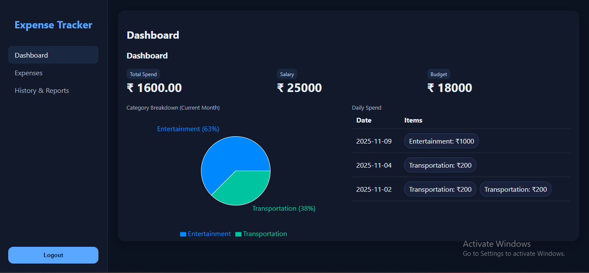
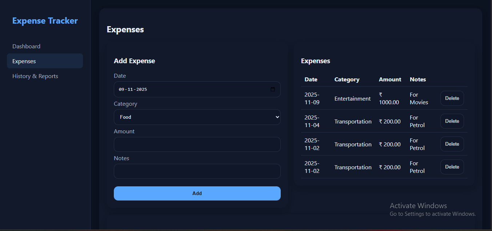
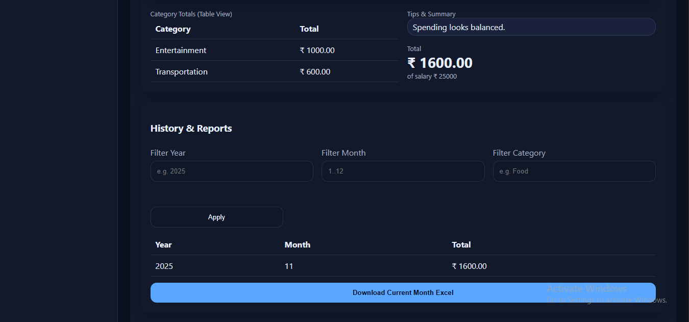

---

## 🧩 BACKEND README (Django)

### 📄 **`backend/README.md`**
```markdown
# 🖥️ Personal Expense Tracker – Backend

This is the **backend** of the Personal Expense Tracker web application, built using **Django**.  
It handles user authentication, expense data storage, budget management, analysis, and report generation.

## 🌐 Live Demo
🔗 **Frontend Deployment:** [https://jade-zabaione-63e6cf.netlify.app](https://jade-zabaione-63e6cf.netlify.app)  
💾 **Frontend Source Code (GitHub):** [https://github.com/Santhosh0619/expense_tracker_frontend](https://github.com/Santhosh0619/expense_tracker_frontend)

---

## 🚀 Features
- User registration and login system
- Manage expenses with category, date, and notes
- Store and retrieve monthly salary and budget
- Generate analytical insights and category summaries
- Export expense reports as downloadable Excel files
- RESTful API architecture for easy frontend integration

---

## 🛠️ Technologies Used
- **Python 3.x**
- **Django Framework**
- **OpenPyXL** (Excel report generation)
- **CORS Headers** (Cross-origin requests)
- **Django Authentication System**

---

## ⚙️ Setup Instructions

### 1. Clone the repository
```bash
git clone https://github.com/your-username/expense-tracker-backend.git
cd expense-tracker-backend
```
### 2. Create a virtual environment and activate it
```bash
python -m venv venv
venv\Scripts\activate      # For Windows
source venv/bin/activate   # For macOS/Linux
```
### 3. Install dependencies
```bash
pip install -r requirements.txt
```
### 4. Run migrations
```bash
python manage.py makemigrations
python manage.py migrate
```
### 5. Run the server
```bash
python manage.py runserver
```

## 🧩 API Endpoints Overview

| Module | HTTP Method | Endpoint | Description |
|--------|--------------|-----------|--------------|
| **Authentication** | `POST` | `/api/auth/register/` | Register a new user |
| **Authentication** | `POST` | `/api/auth/login/` | Log in existing user |
| **Authentication** | `GET` | `/api/auth/logout/` | Log out the current user |
| **Authentication** | `GET` | `/api/auth/me/` | Get current logged-in user info |
| **Dashboard** | `GET` | `/api/dashboard/<year>/<month>/` | Get total spend, budget, salary, and daily expenses |
| **Expense Entry** | `GET` | `/api/expenses/?year=<year>&month=<month>` | Fetch expenses for a specific month |
| **Expense Entry** | `POST` | `/api/expenses/` | Add a new expense |
| **Expense Entry** | `PUT` | `/api/expenses/` | Update an existing expense |
| **Expense Entry** | `DELETE` | `/api/expenses/` | Delete an expense |
| **Budget Management** | `GET` | `/api/budget/<year>/<month>/` | Retrieve salary and budget details |
| **Budget Management** | `POST` | `/api/budget/<year>/<month>/` | Save or update monthly salary and budget |
| **Category Analysis** | `GET` | `/api/analysis/<year>/<month>/` | Get category-wise expense summary and suggestions |
| **History & Reports** | `GET` | `/api/history/?year=<year>&month=<month>&category=<category>` | View previous months’ expenses |
| **History & Reports** | `GET` | `/api/export/<year>/<month>/` | Download monthly report as Excel file |

## 📸 Screenshots

Below are some screenshots of the Personal Expense Tracker web app interface:

### 💻 Dashboard
Displays salary, budget, and total spend with a **Pie Chart** showing category-wise expenses.


### 🧾 Add Expenses
Add new expenses with category, amount, and notes.


### 📊 History & Reports
Bar chart visualization of spending per category.

